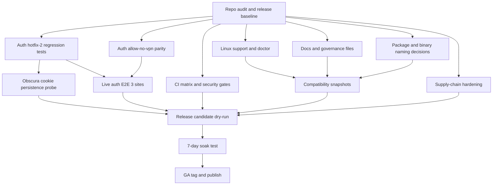
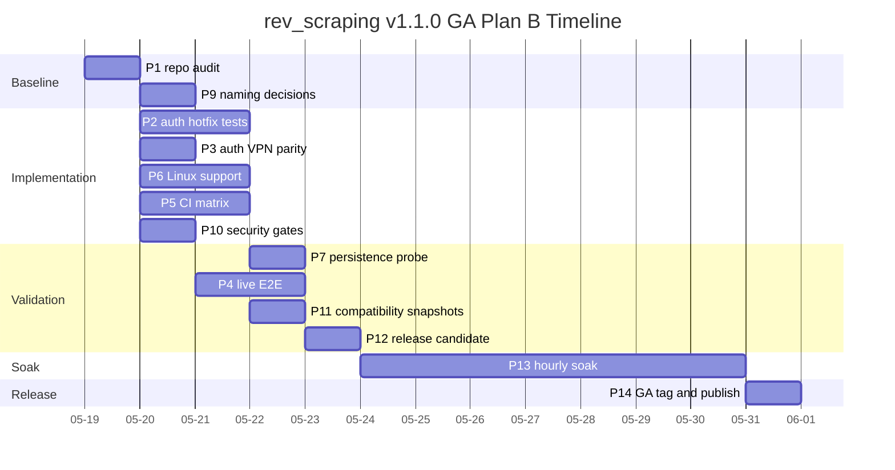

# rev_scraping v1.1.0 GA ExecPlan B (Codex / gpt-5.5-high)
作成日: 2026-05-18 JST
本書は Codex が独立に設計した rev_scraping v1.1.0 GA ExecPlan B である。
並行作成中の別案は参照していない。
設計対象は、v1.0.0-dev の個人ローカル運用状態から、小規模チーム配布、Linux 動作、CI 実 run green、90 日以上の長期運用に耐える GA リリースへ引き上げることである。
現行リポジトリ観測メモ:
- `Cargo.toml` の `workspace.package.rust-version` は `1.83`。 / `Cargo.toml` の `workspace.package.license` は `MIT`。 / 現行 workspace member は 11 crates: `stealth-core`, `mobile-fp`, `vpn-rotate`, `captcha-bypass`, `stealth-cli`, `obscura-bridge`, `stealth-cf`, `stealth-parse`, `stealth-mcp`, `stealth-sites`, `stealth-auth`。 / ユーザー提示の v1.0.0-dev コンテキストは 9 crates として整理されているため、GA では README、crate 名、binary 名、配布名の整合を必須タスクに含める。 / 公式 Rust release 一覧では 2026-04-16 に Rust 1.95.0 が公開済みであり、2026-05-18 時点の stable 判断では 1.95 系を `latest stable` 候補として扱う。
安全原則:
- 本ツールは defender-facing evaluation toolkit として、許可済みターゲットに限定する。 / 外部サイトへの live E2E は、明示的な許可、低頻度、監査ログ、レート制限を前提にする。 / cookie、captcha token、VPN credential、API key はログ、CI artifact、README 例に直書きしない。 / GA 判定は deterministic に行い、主観的な「良さ」ではなく、テスト数、CI matrix、E2E 件数、文書章、soak test 結果で閉じる。
---
## A. Scope 区分
A-01. Scope は MUST / SHOULD / DEFER の 3 階層で管理する。  A-02. MUST は v1.1.0 GA tag を打つ前に完了している必要がある。  A-03. SHOULD は GA 品質を上げるが、明確な理由と issue 化があれば GA gate を塞がない。  A-04. DEFER は v1.1.0 では設計・予告まで行い、実装は v1.2+ に送る。  A-05. MUST 判定基準:
- CI matrix が green になる。 / 実機 E2E が指定数を満たす。 / Linux 動作差分の doctor / README / test が揃う。 / auth cookie の順序保護と persistence が再現手順付きで検証される。 / GA 配布物の最小形が `cargo install` で再現できる。
A-06. MUST 省略時影響度:
- GA 名義の信用を損なう。 / Linux ユーザーが初回セットアップで詰まる。 / spider `--use-auth` の既知 hotfix が実運用で再発する。 / CI green を根拠にした品質保証ができない。 / SECURITY / CONTRIBUTING 欠落によりチーム配布の受け入れが悪くなる。
A-07. SHOULD 判定基準:
- 既存 API を壊さず追加できる。 / mock test で安全に検証できる。 / v1.1.0 の実行時リスクを下げる。 / ドキュメント追加により support 負荷を下げる。 / feature flag で無効化できる。
A-08. SHOULD 省略時影響度:
- UX と診断性が落ちる。 / 長期運用時の調査コストが増える。 / ただし GA の基本動作は維持できる。
A-09. DEFER 判定基準:
- 課金・契約・法務レビューが必要。 / provider 依存が強い。 / 配布署名や notarization など外部審査の時間が読みにくい。 / GUI / SaaS / Windows native のように設計面が独立した大工事になる。
A-10. DEFER 省略時影響度:
- v1.1.0 の小規模チーム配布には直ちに影響しない。 / commercial-grade distribution や大規模監視は v1.2+ まで待つ。 / README roadmap に明示し、利用者の期待値を固定する。
A-11. Scope table:
| Scope | 項目 | 判定基準 | 省略時影響度 |
|---|---|---|---|
| MUST | hotfix-2 再検証 | `spider --use-auth` 本番許可サイトで cookie 順序が preserved | 認証再生が不安定 |
| MUST | auth `--allow-no-vpn` | CLI help / policy / tests / docs が一致 | auth login が spider と運用差分を持つ |
| MUST | 複数サイト E2E | 許可済み 3 site 以上で pass | 1 サイト依存で GA 根拠が弱い |
| MUST | CI 実 run green | macOS/Ubuntu × stable/MSRV | PR 品質保証が成立しない |
| MUST | Linux 動作 | Chrome/keyring/libsecret/VPN doctor | Ubuntu 利用者が詰まる |
| MUST | obscura persistence | cookie 注入後の再起動再利用を検証 | hotfix の実効性が不明 |
| MUST | セキュリティ文書 | SECURITY / CONTRIBUTING / CHANGELOG | チーム導入が難しい |
| SHOULD | country alias | JP/US/UK/DE/FR/SG/AU + ISO fallback | VPN UX が悪い |
| SHOULD | `http_status` | `NavResult` に `Option<u16>` | 403/302 分析が弱い |
| SHOULD | rotation schema | JSON Schema + version | 運用ログ互換性が弱い |
| SHOULD | cookie warning | 24h 未満で stderr warn | E2E 失敗が事前に見えない |
| DEFER | residential proxy | provider 契約が必要 | datacenter block 回避は限定 |
| DEFER | Homebrew tap | release automation 依存 | macOS UX は cargo install に限定 |
| DEFER | notarization | Apple Developer ID 必要 | Gatekeeper 対応は手動案内 |
A-12. GA tag 直前の scope freeze:
- `v1.1.0-ga-freeze` issue を作る。 / MUST は merge block label を付与する。 / SHOULD は `ship` / `move-to-v1.2` の二択で triage する。 / DEFER は roadmap に残す。
A-13. Scope 変更ルール:
- MUST 追加は owner と test evidence を同時に決める。 / MUST 削除は release owner の明示承認を必要にする。 / SHOULD 追加は blast radius が小さいものだけ許可する。 / DEFER の前倒しは原則行わない。
A-14. Compatibility boundary:
- v1.0.0-dev の config は読み続ける。 / MCP tool 名は削除しない。 / CLI 引数は追加のみを原則にする。 / JSON output は field 追加のみを原則にする。
A-15. Security boundary:
- AUP allowlist は維持する。 / `REV_SCRAPING_AUP_ACK` の日次 TTL は維持する。 / auth cookie 値は stdout / stderr / JSON / log に出さない。 / CI artifact に live site HTML を残さない。
A-16. Performance boundary:
- GA で新しい hot path は増やさない。 / `rev measure` は単発診断であり spider pipeline の標準経路には入れない。 / Browser / CDP の再起動回数は E2E で観測する。
A-17. Documentation boundary:
- README §15-§20 は GA gate に含める。 / operator 向けと contributor 向けを分ける。 / law / ToS は断定的法律助言ではなく注意喚起として書く。
A-18. Release boundary:
- v1.1.0 は source + cargo install を一次配布にする。 / brew / npm / single binary は roadmap に載せる。 / crates.io publish は dependency order を固定して dry-run する。
A-19. Quality target:
- 既存 459 PASS を 500 PASS 以上へ増やす。 / `clippy -D warnings` を維持する。 / `rustfmt --check` を維持する。 / SPDX check を維持する。
A-20. Exit criteria:
- R 章の deterministic criteria をすべて満たす。 / Q 章の DECISION NEEDED が release owner により処理済みになる。 / O 章の rollback 手順が README release note から辿れる。
---
## B. MUST 候補
B-01. MUST は B1-B8 として扱う。  B-02. B1. hotfix-2 再検証: cookie 順序保護。
- 目的: `spider --use-auth` で `Cookie` header または CDP `Network.setCookies` の順序が期待通り維持されることを本番許可サイトで確認する。 / Definition of Done: hotfix-2 適用後の `spider --use-auth PROFILE --dump-html` が許可サイトで認証済み DOM を取得する。 / Definition of Done: `__Host-`, `__Secure-`, `SameSite=None`, host-only cookie の扱いが regression test 化される。 / Definition of Done: cookie 値を出さず、name/domain/path/expires/order hash のみを audit に残す。 / テスト方法: unit test で jar merge order を検証する。 / テスト方法: integration test で `rev auth login` 済み profile を `spider --use-auth` に渡す。 / テスト方法: live test は `REV_LIVE=1 REV_AUTH_PROFILE=...` gate にする。 / 想定工数: 0.75 engineer-day。 / Owner: Rust auth/browser owner。
B-03. B1 の実装対象 API 例:
```rust
pub fn merge_cookie_replay_order(
    stored: &[StoredCookie],
    browser_existing: &[StoredCookie],
    request_domain: &str,
) -> Vec<StoredCookie>;
```
B-04. B1 の検証コマンド例:
```shell
REV_LIVE=1 \
REV_AUTH_PROFILE=daigo_note \
REV_SCRAPING_AUP_ACK="$(date +%F)" \
cargo test -p stealth-cli --test e2e_auth_flow -- --ignored --nocapture
```
B-05. B2. `rev auth login --allow-no-vpn` flag 追加。
- 目的: spider 側に存在する `--allow-no-vpn` と auth login / refresh の policy surface を一致させる。 / Definition of Done: `rev-stealth auth login --allow-no-vpn` と `auth refresh --allow-no-vpn` が clap help に表示される。 / Definition of Done: env `REV_SCRAPING_REQUIRE_VPN=1` がある場合は `--allow-no-vpn` でも緩和できない。 / Definition of Done: `policy.toml` の default requirement と CLI override の優先順位が spider と一致する。 / Definition of Done: README §16 と §20 に auth login の VPN policy 差分が記載される。 / テスト方法: clap snapshot または string assertion。 / テスト方法: unit test で require/allow/env の truth table を検証。 / テスト方法: `auth login` subprocess spawn 前に fail-closed するケースを mock。 / 想定工数: 0.5 engineer-day。 / Owner: CLI owner。
B-06. B2 の CLI struct 例:
```rust
#[derive(clap::Args, Debug, Clone)]
pub struct LoginArgs {
    #[arg(long)]
    pub profile: String,
    #[arg(long)]
    pub url: String,
    #[arg(long = "allow-no-vpn", conflicts_with = "require_vpn")]
    pub allow_no_vpn: bool,
    #[arg(long = "require-vpn", conflicts_with = "allow_no_vpn")]
    pub require_vpn: bool,
}
```
B-07. B3. spider `--use-auth` の複数サイト実機 E2E。
- 目的: DaiGo 1 サイト依存を避け、cookie capture / replay / persistence を 3 サイト以上で検証する。 / Definition of Done: 許可済み 3 site 以上で `auth login -> status -> spider --use-auth -> dump/assert` が pass。 / Definition of Done: 少なくとも 1 site は Cloudflare 有効、1 site は SPA、1 site は traditional server-rendered page。 / Definition of Done: site-specific assertion は secret や個人情報を含まない marker のみにする。 / Definition of Done: `#[ignore]` + `REV_LIVE=1` で通常 CI から隔離。 / テスト方法: local live run。 / テスト方法: `tests/live_manifest.example.toml` を追加し、実値は repo に入れない。 / テスト方法: HTML dump は default off、失敗時 artifact は redacted metadata のみ。 / 想定工数: 1.0 engineer-day + 人間ログイン時間。 / Owner: E2E owner。
B-08. B3 の live manifest 例:
```toml
[[sites]]
name = "authorized-cf-site"
url = "https://example.test/account"
profile = "example"
assert_selector = "body"
requires_vpn = false

[[sites]]
name = "authorized-spa-site"
url = "https://spa.example.test/dashboard"
profile = "spa"
assert_selector = "[data-test=dashboard]"
requires_vpn = false
```
B-09. B4. CI 実 run green。
- 目的: GitHub Actions が push / PR で本当に通る状態にする。 / Definition of Done: matrix `macos-14`, `ubuntu-22.04` × `stable`, `1.83.0` が green。 / Definition of Done: `continue-on-error: true` を GA 必須 job から除去する。 / Definition of Done: obscura binary cache が artifact fan-out で安定する。 / Definition of Done: `cargo-deny`, `cargo audit`, SPDX, docs build が green。 / テスト方法: PR を作り、実 run URL を release checklist に貼る。 / テスト方法: local `act` は補助扱いにして、最終判定は GitHub hosted runner。 / テスト方法: macOS job の Chrome path を doctor で検証。 / 想定工数: 1.5 engineer-day。 / Owner: CI owner。
B-10. B5. Linux 動作。
- 目的: Ubuntu 22.04 で Chrome path、Secret Service、libsecret、Docker VPN、ProtonVPN CLI 差分を明文化し、doctor に反映する。 / Definition of Done: Chrome 探索順が実装される。 / Definition of Done: `libsecret-1-0`, `dbus-user-session`, `gnome-keyring` の要否を README §16 に書く。 / Definition of Done: headless server で keyring が使えない場合、passphrase encrypted store へ落とす手順がある。 / Definition of Done: Docker VPN は `--cap-add=NET_ADMIN --device=/dev/net/tun` を README に明記する。 / Definition of Done: Ubuntu CI で non-live doctor mock test が pass。 / テスト方法: Ubuntu 22.04 fresh VM。 / テスト方法: GitHub Actions Ubuntu runner。 / テスト方法: Docker socket がない状態の doctor error が明確。 / 想定工数: 1.25 engineer-day。 / Owner: Linux owner。
B-11. B5 の Chrome 探索 API 例:
```rust
pub fn discover_chrome_binary() -> Option<std::path::PathBuf> {
    const CANDIDATES: &[&str] = &[
        "/Applications/Google Chrome.app/Contents/MacOS/Google Chrome",
        "/usr/bin/google-chrome",
        "/usr/bin/google-chrome-stable",
        "/snap/bin/chromium",
        "/usr/bin/chromium-browser",
        "/usr/bin/chromium",
    ];
    CANDIDATES.iter().map(std::path::PathBuf::from).find(|p| p.exists())
}
```
B-12. B5 の Linux setup smoke:
```shell
sudo apt-get update
sudo apt-get install -y google-chrome-stable libsecret-1-0 dbus-user-session gnome-keyring
cargo run -p stealth-cli -- doctor --skip-exit-ip --output-format json
```
B-13. B6. obscura cookie 注入 + persistence 実機検証。
- 目的: anti-fingerprint extension と cookie replay が競合せず、ブラウザ再起動後も期待状態が再現することを確認する。 / Definition of Done: `auth login` で保存した profile を使い、obscura restart 後の `spider --use-auth` が pass。 / Definition of Done: extension 有効/無効の両方で cookie replay order を比較する。 / Definition of Done: CDP `Network.getAllCookies` または同等の metadata 検査を redacted で記録する。 / Definition of Done: persistence 失敗時の error classification が transient/permanent に分かれる。 / テスト方法: local live E2E。 / テスト方法: mock CDP adapter で injection call order を検証。 / テスト方法: browser profile dir を tempdir と persistent dir で比較。 / 想定工数: 1.0 engineer-day。 / Owner: Browser owner。
B-14. B6 の persistence harness 例:
```rust
pub struct CookiePersistenceProbe {
    pub profile: String,
    pub url: url::Url,
    pub extension_enabled: bool,
    pub browser_user_data_dir: std::path::PathBuf,
}

pub async fn verify_cookie_persistence(
    probe: CookiePersistenceProbe,
) -> anyhow::Result<PersistenceReport>;
```
B-15. B7. Docs / governance files。
- 目的: 小規模チーム配布に必要な README §15-§20、CHANGELOG、SECURITY、CONTRIBUTING、CODE_OF_CONDUCT を揃える。 / Definition of Done: README に §15-§20 が存在する。 / Definition of Done: CHANGELOG は Keep a Changelog 形式。 / Definition of Done: SECURITY は private vulnerability report の窓口と暗号方針を含む。 / Definition of Done: CONTRIBUTING は local setup、test tiers、live test 禁止事項を含む。 / Definition of Done: CODE_OF_CONDUCT は採用テンプレートを明記する。 / テスト方法: `rg '^## §1[5-9]|^## §20' README.md`。 / テスト方法: markdown link check。 / テスト方法: SPDX script が新規 docs にも通る方針を決める。 / 想定工数: 0.75 engineer-day。 / Owner: Docs owner。
B-16. B8. Workspace / package naming 整合。
- 目的: README の 9 crates 記述、現行 11 crates、ユーザー文脈の `rev-*` 名称、実装上の `stealth-*` 名称を GA 前に説明可能にする。 / Definition of Done: README の Project layout が実際の 11 workspace members と一致する。 / Definition of Done: public binary 名 `rev`, `rev-mcp`, `rev-doctor` と現行 `rev-stealth`, `stealth-mcp`, `rev-auth` の最終方針を Q 章 decision として処理する。 / Definition of Done: crates.io publish 名の衝突調査を release checklist に入れる。 / Definition of Done: MCP tool 数 15 と code registry が一致する。 / テスト方法: `cargo metadata` から README table を検査する script。 / テスト方法: `cargo run -p stealth-mcp -- tools/list` 相当で tool 数を確認。 / テスト方法: CLI help snapshot。 / 想定工数: 0.5 engineer-day。 / Owner: Release owner。
B-17. MUST aggregate estimate:
- B1: 0.75 day。 / B2: 0.5 day。 / B3: 1.0 day + login coordination。 / B4: 1.5 day。 / B5: 1.25 day。 / B6: 1.0 day。 / B7: 0.75 day。 / B8: 0.5 day。 / 合計: 7.25 engineer-day + human review + CI queue。
B-18. MUST gating command group:
```shell
cargo test --workspace --no-fail-fast
cargo clippy --workspace --all-targets --all-features -- -D warnings
cargo fmt --all -- --check
./scripts/check_source_and_spdx.sh
```
B-19. MUST live gating command group:
```shell
REV_LIVE=1 REV_SCRAPING_AUP_ACK="$(date +%F)" \
cargo test --workspace -- --ignored --nocapture
```
B-20. MUST release owner checklist:
- CI run URL を残す。 / live E2E 実施日時を残す。 / soak test 開始/終了日時を残す。 / CHANGELOG の tag section を freeze する。 / rollback test を 1 回実行する。
---
## C. SHOULD 候補
C-01. SHOULD は C1-C10 として扱う。  C-02. C1. `country_alias` 拡張。
- 対象: JP/US/UK/DE/FR/SG/AU と ISO-3166 fallback。 / 完了条件: lowercase、uppercase、common English name、ISO-2 を同じ resolver で処理。 / テスト方法: proptest で case-insensitive / trim / hyphen を検証。 / 想定工数: 0.25 engineer-day。 / 省略時影響: VPN UX が弱いが GA は可能。
C-03. C1 API 例:
```rust
pub fn resolve_country_alias(input: &str) -> Result<IsoCountry, CountryAliasError>;
```
C-04. C2. `NavResult.http_status: Option<u16>` 追加。
- 対象: obscura path と reqwest fallback path の navigation result。 / 完了条件: HTTP status が取れる path では `Some(status)`、CDP 制約で取れない path は `None` にする。 / 完了条件: MCP output schema は field 追加のみ。 / テスト方法: local mock server で 200/302/403/500。 / 想定工数: 0.5 engineer-day。 / 省略時影響: 403 残存時の診断が弱い。
C-05. C2 struct 例:
```rust
#[derive(Debug, Clone, serde::Serialize, serde::Deserialize)]
pub struct NavResult {
    pub url: String,
    pub final_url: String,
    pub html: String,
    pub http_status: Option<u16>,
    pub used_fallback: bool,
}
```
C-06. C3. `vpn_rotation_events.jsonl` JSON Schema 公開。
- 対象: rotation event log の `schema_version` を `1` として固定。 / 完了条件: `docs/schemas/vpn_rotation_event.v1.schema.json` を追加。 / 完了条件: README §15 に schema location を記載。 / テスト方法: `jsonschema` CLI または Rust `jsonschema` crate で fixture 検証。 / 想定工数: 0.5 engineer-day。 / 省略時影響: 長期運用ログ互換性が曖昧。
C-07. C3 schema 断片:
```json
{
  "$schema": "https://json-schema.org/draft/2020-12/schema",
  "$id": "https://rev-c.org/rev_scraping/schemas/vpn_rotation_event.v1.json",
  "type": "object",
  "required": ["schema_version", "timestamp", "event", "provider"],
  "properties": {
    "schema_version": { "const": 1 },
    "timestamp": { "type": "string", "format": "date-time" },
    "event": { "type": "string" },
    "provider": { "type": "string" }
  }
}
```
C-08. C4. cookie auto-refresh warning。
- 対象: 有効期限 24h 未満の cookie が profile にある場合 stderr warn。 / 完了条件: JSON output には `auth_warning` metadata、stderr には redacted warning。 / 完了条件: cookie 値は一切出さない。 / テスト方法: fixture profile の expires を固定。 / 想定工数: 0.25 engineer-day。 / 省略時影響: live E2E 失敗の予兆が見えにくい。
C-09. C5. `rev measure <url>` subcommand。
- 対象: TTFB / DOM ready / first-byte size の単発計測。 / 完了条件: AUP gate を通す。 / 完了条件: reqwest path と browser path を選べる。 / 完了条件: JSON output を stable にする。 / テスト方法: mock HTTP server。 / 想定工数: 0.75 engineer-day。 / 省略時影響: performance diagnosis は外部ツール頼み。
C-10. C5 output 例:
```rust
#[derive(Debug, serde::Serialize)]
pub struct MeasureReport {
    pub url: String,
    pub final_url: String,
    pub http_status: Option<u16>,
    pub ttfb_ms: u64,
    pub dom_ready_ms: Option<u64>,
    pub first_byte_size: usize,
    pub fetcher: String,
}
```
C-11. C6. `rev doctor` 強化。
- 対象: Chrome version、VPN binary、keyring/libsecret、disk、network。 / 完了条件: `doctor --output-format json` に checks array を追加。 / 完了条件: existing fields は維持。 / 完了条件: fail-open を避け、critical check は exit 7。 / テスト方法: mock filesystem / PATH。 / 想定工数: 0.75 engineer-day。 / 省略時影響: Linux support の問い合わせが増える。
C-12. C7. README §15-§20 拡充。
- 対象: Troubleshooting / Linux Setup / FAQ / Compliance / Glossary / Migration。 / 完了条件: 章番号が連続し、リンクが壊れていない。 / テスト方法: markdown link checker。 / 想定工数: B7 に包含。 / 省略時影響: GA 利用者が self-service できない。
C-13. C8. `cargo nextest` optional profile。
- 対象: local と CI optional job。 / 完了条件: `nextest.toml` に default / live profile を作る。 / テスト方法: `cargo nextest run --workspace`。 / 想定工数: 0.25 engineer-day。 / 省略時影響: CI 時間はやや長くなる。
C-14. C9. `insta` snapshot の限定採用。
- 対象: CLI help / JSON schema / MCP tools/list。 / 完了条件: snapshot review 手順を CONTRIBUTING に書く。 / テスト方法: `INSTA_UPDATE=always` を禁止し、reviewed snapshots のみ commit。 / 想定工数: 0.5 engineer-day。 / 省略時影響: CLI schema regression を見落としやすい。
C-15. C10. `cargo udeps` / `cargo machete` advisory。
- 対象: release checklist の手動実行。 / 完了条件: unused dependency report を issue 化する。 / テスト方法: nightly dependent なら advisory のみ。 / 想定工数: 0.25 engineer-day。 / 省略時影響: 依存整理は v1.2 へ遅れる。
C-16. SHOULD prioritization:
| ID | 優先 | 理由 |
|---|---:|---|
| C6 | 1 | Linux GA と直結 |
| C7 | 1 | GA docs と直結 |
| C4 | 2 | auth E2E 安定性 |
| C2 | 2 | 403 診断 |
| C3 | 3 | 長期運用ログ |
| C1 | 3 | VPN UX |
| C5 | 4 | 便利だが必須ではない |
| C8 | 4 | CI 改善 |
| C9 | 4 | regression 観測 |
| C10 | 5 | cleanup |
C-17. SHOULD implementation rule:
- MUST の critical path を塞がない。 / CLI / MCP の breaking change を入れない。 / live site E2E を増やす場合は owner 明示。 / doc-only SHOULD は freeze 直前でも可。
C-18. SHOULD cut line:
- B4 の CI が赤い間は C5 `rev measure` を着手しない。 / B5 の Linux doctor が未完成なら C1 を後回し。 / B1/B6 の auth path が安定するまで C4 以外の auth 追加は抑制。
C-19. SHOULD test expansion target:
- C1 で +12 tests。 / C2 で +8 tests。 / C3 で +4 tests。 / C4 で +5 tests。 / C5 で +12 tests。 / C6 で +10 tests。 / C9 で +5 snapshots。
C-20. SHOULD expected total:
- 合計 3.75 engineer-day。 / MUST から漏れた場合は v1.1.1 patch ではなく v1.2 milestone へ移す。
---
## D. DEFER
D-01. DEFER は v1.2+ roadmap として扱う。  D-02. D1. residential proxy provider 統合。
- 候補: Bright Data / Smartproxy / IPRoyal など。 / v1.1.0 の扱い: 自前実装しない。 / 理由: 契約、課金、法務、provider ToS、credential storage、abuse prevention が必要。 / v1.1.0 deliverable: `cf-evaluate` が datacenter IP block を検出した場合、residential proxy が範囲外であることを説明する。
D-03. D2. Homebrew tap `homebrew-rev` 公開。
- v1.1.0 の扱い: roadmap に載せる。 / 理由: tap 運用、bottle、codesign、formula test が必要。 / v1.1.0 deliverable: cargo install 手順を first-class にする。
D-04. D3. cargo-dist auto-update / self-update。
- v1.1.0 の扱い: 設計メモまで。 / 理由: release artifact、checksum、supply-chain、rollback が複雑。 / v1.1.0 deliverable: tag push release workflow のみ。
D-05. D4. Prometheus exporter / OpenTelemetry。
- v1.1.0 の扱い: 実装しない。 / 理由: local tool から daemon/agent 運用へ責務が広がる。 / v1.1.0 deliverable: JSONL logs と issue template で代替。
D-06. D5. WARP advanced guide。
- 対象: split tunnel / Teams Zero Trust。 / v1.1.0 の扱い: basic WARP 注意のみ。 / 理由: 組織 policy と Zero Trust 設定依存が強い。
D-07. D6. macOS notarization + Apple Developer ID。
- v1.1.0 の扱い: 実装しない。 / 理由: Developer ID、notarytool、CI secret、staple 検証が必要。 / v1.1.0 deliverable: macOS Gatekeeper の手動説明。
D-08. D7. GUI / Web dashboard。
- v1.1.0 の扱い: 実装しない。 / 理由: auth cookie と live target を扱う GUI は threat model が別。 / v1.1.0 deliverable: CLI/MCP を安定化。
D-09. D8. Windows native support。
- v1.1.0 の扱い: Windows native は対象外。 / 理由: keyring, Chrome path, VPN CLI, process isolation の差分が大きい。 / v1.1.0 deliverable: WSL2 は tier3 preview として docs のみ。
D-10. D9. npm wrapper。
- v1.1.0 の扱い: 実装しない。 / 理由: postinstall binary download と supply chain risk が大きい。 / v1.1.0 deliverable: npm は roadmap。
D-11. D10. single static binary。
- v1.1.0 の扱い: 実装しない。 / 理由: Chrome / obscura / keyring / libsecret を完全内包できない。 / v1.1.0 deliverable: source build と cargo install。
D-12. DEFER acceptance:
- README §20 / roadmap に明記する。 / GitHub milestone `v1.2` に issue 化する。 / v1.1.0 release note には「含まれないもの」として書く。
D-13. DEFER risk:
- proxy がないため Cloudflare datacenter block の一部は回避できない。 / brew がないため macOS non-Rust user の導入障壁が残る。 / notarization がないため downloaded binary 配布は控える。
D-14. DEFER wording:
- 「v1.1.0 は local/team source distribution の GA」と説明する。 / 「commercial SaaS / broad binary distribution の GA」と誤読させない。
D-15. v1.2 entry criteria:
- v1.1.0 soak test が完了。 / security advisory process が運用済み。 / at least 3 external user feedback items が集まる。 / proxy/provider legal review の担当が決まる。
---
## E. クレート構成変更
E-01. 現行 workspace は 11 crates で観測される。  E-02. GA 文書では、実装名 `stealth-*` と利用者-facing 名 `rev` を分ける。  E-03. 新規 crate `rev-measure` は v1.1.0 では作らないことを推奨する。  E-04. 理由:
- `rev measure` は SHOULD であり GA core ではない。 / `stealth-cli` 内の subcommand と `obscura-bridge` / `reqwest` helper で足りる。 / 新 crate は publish order と semver surface を増やす。 / v1.2 で measurement が独立プロダクト化するなら分離できる。
E-05. 代替案:
- `rev-measure` crate を作る。 / `stealth-core::measure` module に入れる。 / `stealth-cli::commands::measure` に閉じる。
E-06. 推奨: v1.1.0 は `stealth-cli::commands::measure` に閉じ、public reusable API は作らない。  E-07. API 凍結ポリシー:
- crates.io に publish する crate の public API は semver 対象。 / workspace 内だけで使う unstable module は `pub(crate)` を優先。 / test helper は `#[cfg(test)]` または `dev-support` feature に閉じる。 / 将来公開予定だが v1.1.0 で保証しない API は `#[doc(hidden)]` を付ける。
E-08. `#[doc(hidden)]` 使用方針:
- MCP internal CLI bridge。 / browser adapter mock。 / migration compatibility shim。 / generated schema helper。
E-09. `#[doc(hidden)]` 禁止対象:
- CLI JSON output type。 / config file schema。 / auth store metadata schema。 / VPN rotation event schema。
E-10. feature flags 推奨:
```toml
[features]
default = ["vpn", "captcha", "mcp"]
vpn = ["vpn-rotate"]
captcha = ["captcha-bypass"]
mcp = ["stealth-mcp"]
passphrase-only = ["stealth-auth/passphrase-only"]
live-tests = []
```
E-11. feature flag 方針:
- `default` は小規模チームの標準利用を満たす。 / `vpn` は Docker / provider dependency を含む。 / `captcha` は external solver credential を必要にするため tests は gated。 / `mcp` は stdio server を含む。 / `passphrase-only` は Linux keyring fallback 用。
E-12. crate publish order:
1. `stealth-core`
2. `mobile-fp`
3. `vpn-rotate`
4. `captcha-bypass`
5. `obscura-bridge`
6. `stealth-cf`
7. `stealth-parse`
8. `stealth-sites`
9. `stealth-auth`
10. `stealth-cli`
11. `stealth-mcp`
E-13. crate naming decision:
- v1.1.0 で crates.io publish を行うなら、`rev-*` 名の空き状況を事前調査する。 / 空いていない場合は現行 `stealth-*` を維持し、binary 名で `rev` branding を担保する。 / README は crate 名と binary 名を混同しない。
E-14. Binary policy:
- primary CLI: `rev` への alias を検討する。 / compatibility CLI: `rev-stealth` を残す。 / auth helper: `rev-auth` を internal helper として docs に出す。 / MCP server: `rev-mcp` への alias を検討する。 / doctor: standalone `rev-doctor` が必要かは Q 章 decision にする。
E-15. Semver policy:
- v1.1.0 以降、config と MCP schema は additive-only。 / breaking change は v2 まで避ける。 / security fix による default behavior 変更は CHANGELOG に明記する。
E-16. Internal data schema:
- `auth` metadata は `schema_version` を持つ。 / `vpn_rotation_events` は v1 schema を持つ。 / `site recipes` は version を持つ。 / `parse.sqlite` migration は forward-only + backup。
E-17. Dependency governance:
- RC / beta / alpha / dev crate は GA default path から外す。 / 現行 `wreq = "=6.0.0-rc.28"` は J 章で剥がすか隔離する。 / yanked version は cargo-deny で fail。
E-18. Workspace lint:
- `unsafe_code = "forbid"` は維持。 / `missing_docs` は v1.1.0 では warn にしない。 / `rustdoc::broken_intra_doc_links` は docs build で deny。
E-19. Public docs:
- docs.rs build は `--no-deps` で確認。 / private/internal symbols は docs から隠す。 / CLI examples は authorized target のみ。
E-20. E 章 conclusion:
- v1.1.0 で crate 増加は避ける。 / API を狭くし、docs と schema を安定させる。 / package branding の整合を B8 と Q 章で処理する。
---
## F. CI/CD 設計
F-01. CI は deterministic release gate である。  F-02. 必須 matrix:
- OS: `macos-14`, `ubuntu-22.04`。 / Toolchain: `stable`, `1.83.0`。 / stable は 2026-05-18 時点で Rust 1.95.0 系を想定。 / MSRV は現行 `rust-version = "1.83"` と一致させる。
F-03. optional matrix:
- `windows-2022` + WSL2 smoke。 / nightly clippy。 / live tests manual workflow。
F-04. CI job categories:
- format。 / clippy。 / unit tests。 / integration tests。 / ignored obscura E2E。 / docs build。 / security checks。 / license/SPDX。 / release dry-run。
F-05. YAML 雛形 1: CI。
```yaml
name: ci

on:
  pull_request:
  push:
    branches: [main]

env:
  CARGO_TERM_COLOR: always
  RUSTFLAGS: "-D warnings"

jobs:
  test:
    name: test ${{ matrix.os }} / ${{ matrix.toolchain }}
    runs-on: ${{ matrix.os }}
    strategy:
      fail-fast: false
      matrix:
        os: [ubuntu-22.04, macos-14]
        toolchain: [stable, "1.83.0"]
    steps:
      - uses: actions/checkout@v4
        with:
          submodules: recursive
      - uses: dtolnay/rust-toolchain@master
        with:
          toolchain: ${{ matrix.toolchain }}
          components: rustfmt, clippy
      - uses: Swatinem/rust-cache@v2
        with:
          shared-key: ${{ matrix.os }}-${{ matrix.toolchain }}
      - name: fmt
        run: cargo fmt --all -- --check
      - name: clippy
        run: cargo clippy --workspace --all-targets --all-features -- -D warnings
      - name: test
        run: cargo test --workspace --no-fail-fast
      - name: docs
        run: RUSTDOCFLAGS="-D warnings" cargo doc --workspace --all-features --no-deps
      - name: SPDX
        run: ./scripts/check_source_and_spdx.sh
```
F-06. YAML 雛形 2: security / supply chain。
```yaml
name: security

on:
  pull_request:
  push:
    branches: [main]
  schedule:
    - cron: "17 3 * * 1"

jobs:
  supply-chain:
    runs-on: ubuntu-22.04
    steps:
      - uses: actions/checkout@v4
      - uses: dtolnay/rust-toolchain@stable
      - uses: taiki-e/install-action@cargo-deny
      - uses: taiki-e/install-action@cargo-audit
      - name: cargo deny
        run: cargo deny check
      - name: cargo audit
        run: cargo audit --deny warnings
      - name: gitleaks
        uses: gitleaks/gitleaks-action@v2
        env:
          GITHUB_TOKEN: ${{ secrets.GITHUB_TOKEN }}
```
F-07. obscura cache / E2E は `vendor/obscura` source hash を key に `vendor/obscura/target` を cache し、build job が `obscura-binary` artifact を 1 day retention で fan-out する。ignored non-live E2E は `REV_SCRAPING_RUN_OBSCURA=1`、`OBSCURA_BIN`、`REV_STEALTH_OBSCURA` を明示して実行する。
F-08. YAML 雛形 4: release。
```yaml
name: release

on:
  push:
    tags:
      - "v*.*.*"

jobs:
  publish:
    runs-on: ubuntu-22.04
    environment: crates-io
    steps:
      - uses: actions/checkout@v4
      - uses: dtolnay/rust-toolchain@stable
      - name: verify tag version
        run: cargo metadata --format-version 1 > target/metadata.json
      - name: package all crates
        run: cargo package --workspace --allow-dirty
      - name: publish dependency order
        env:
          CARGO_REGISTRY_TOKEN: ${{ secrets.CARGO_REGISTRY_TOKEN }}
        run: |
          cargo publish -p stealth-core
          cargo publish -p mobile-fp
          cargo publish -p vpn-rotate
          cargo publish -p captcha-bypass
          cargo publish -p obscura-bridge
          cargo publish -p stealth-cf
          cargo publish -p stealth-parse
          cargo publish -p stealth-sites
          cargo publish -p stealth-auth
          cargo publish -p stealth-cli
          cargo publish -p stealth-mcp
```
F-09. nightly clippy:
- nightly は advisory job。 / `continue-on-error: true` を許す。 / GA gate には含めない。 / reason: nightly lint churn を release blocker にしない。
F-10. docs.rs build:
```shell
RUSTDOCFLAGS="-D warnings" cargo doc --workspace --all-features --no-deps
cargo package --workspace --allow-dirty
```
F-11. cargo-deny:
- license whitelist: MIT, Apache-2.0, BSD-2-Clause, BSD-3-Clause, ISC, Unicode-3.0。 / GPL / AGPL は deny。 / BSL は dependency として deny。 / unknown registry は deny。
F-12. cargo audit:
- `cargo audit --deny warnings`。 / false positive は `audit.toml` に期限付きで記録。 / advisory ignore は CVE/GHSA、理由、期限、owner を必須。
F-13. obscura cache strategy:
- `vendor/obscura` の source hash を cache key にする。 / `vendor/obscura/target` を cache。 / release artifact として binary は retention 1 day。 / CI artifact に user profile や cookies は含めない。
F-14. secret injection:
- `CAPSOLVER_API_KEY` は repo secret。 / live captcha tests は workflow_dispatch のみ。 / PR from fork では secret を使わない。 / secret がない場合は skip ではなく explicit `ignored live` として扱う。
F-15. live workflow:
- `workflow_dispatch`。 / inputs: `target_set`, `run_captcha`, `run_vpn`, `rate_limit`。 / required environment: `live-e2e`。 / human approval を必須にする。
F-16. release workflow guard:
- tag version と workspace version が一致。 / CHANGELOG に tag section が存在。 / cargo package が全 crate で成功。 / publish は dependency order。 / publish 失敗時は O 章 rollback。
F-17. CI success definition:
- required jobs: fmt/clippy/test/docs/security/spdx。 / required matrix: 2 OS × 2 toolchain。 / obscura ignored E2E は non-live required。 / live E2E は release checklist required だが PR required ではない。
F-18. CI observed issue:
- 現行 `.github/workflows/ci.yml` には `continue-on-error: true` の E2E job がある。 / GA では E2E を required/non-required に分け、required job では continue-on-error を外す。
F-19. CI artifact policy:
- failed unit logs は可。 / HTML dump は不可。 / cookie jar は不可。 / target debug symbols は必要時のみ短期 retention。
F-20. CI output:
- release note に CI run link を貼る。 / security weekly job の直近 green を確認する。 / MSRV job の failure は release blocker。
---
## G. Linux 差分
G-01. Linux は v1.1.0 で tier2 support とすることを推奨する。  G-02. tier2 の意味:
- Ubuntu 22.04 で CI green。 / README 手順を提供。 / core CLI / MCP / doctor は動作確認。 / live VPN/provider は環境依存として手順提供。
G-03. Chrome path 探索順:
1. explicit `--obscura` / env `REV_STEALTH_OBSCURA`。
2. explicit Chrome env `CHROME` / `CHROME_BIN`。
3. `/usr/bin/google-chrome`。
4. `/usr/bin/google-chrome-stable`。
5. `/snap/bin/chromium`。
6. `which chromium-browser`。
7. `which chromium`。
8. macOS path。
G-04. Chrome detection shell:
```shell
command -v google-chrome || true
command -v google-chrome-stable || true
command -v chromium-browser || true
command -v chromium || true
```
G-05. snap Chromium caveat:
- snap sandbox が profile dir / CDP port / network namespace と干渉する可能性がある。 / README では Google Chrome deb を推奨し、snap は fallback とする。
G-06. keyring:
- Linux は Secret Service API を前提にする。 / packages: `libsecret-1-0`, `dbus-user-session`, `gnome-keyring`。 / headless server では DBus session がないことが多い。
G-07. keyring fallback:
- `stealth-auth` の passphrase mode を正式手順にする。 / fallback は file-based encrypted store。 / encryption: Argon2id + XChaCha20Poly1305 または現行 ChaCha20Poly1305 方針を明文化。 / passphrase は env ではなく prompt 推奨。
G-08. Linux keyring probe:
```shell
dbus-run-session -- cargo run -p stealth-cli -- auth status --profile smoke
```
G-09. ProtonVPN CLI:
- macOS と Linux で CLI 名、login 方法、root 要否が異なる。 / v1.1.0 では root 不要モードの可否を調査し、doctor に binary/path/version を出す。 / ProtonVPN への hard dependency は避ける。
G-10. WARP:
- Cloudflare WARP は install 方法が distro 依存。 / v1.1.0 では basic status check と docs まで。 / Teams / split tunnel は D5 に送る。
G-11. Docker VPN:
- Gluetun / Docker path は Linux の primary guide にする。 / `--cap-add=NET_ADMIN` が必須。 / `/dev/net/tun` device が必須。 / IPv6 disable と DNS lock を doctor で検証。
G-12. Docker run example:
```shell
docker run -d --name gluetun \
  --cap-add=NET_ADMIN \
  --device=/dev/net/tun \
  -e VPN_SERVICE_PROVIDER=surfshark \
  -e VPN_TYPE=openvpn \
  -e OPENVPN_USER="$SURFSHARK_USER" \
  -e OPENVPN_PASSWORD="$SURFSHARK_PASSWORD" \
  -e FIREWALL=on \
  qmcgaw/gluetun
```
G-13. Linux filesystem:
- config: `~/.config/rev/config.toml` 互換。 / app data: `~/.rev_scraping/` 既存互換。 / auth store: `~/.rev_scraping/auth/` 0700。 / recipe store: `~/.rev_scraping/sites/` 0700。
G-14. Linux permissions:
- auth file は 0600。 / directories は 0700。 / docker socket access は operator group policy に任せる。 / root 実行は推奨しない。
G-15. Linux CI limitations:
- GitHub hosted runner は system Chrome がない場合がある。 / setup step で Chrome を install するか、browser tests を obscura binary mock に寄せる。 / live browser E2E は self-hosted runner も選択肢。
G-16. Linux doctor additions:
- `chrome_binary`。 / `chrome_version`。 / `secret_service_available`。 / `libsecret_available`。 / `dbus_session_available`。 / `docker_available`。 / `tun_available`。 / `vpn_binary_versions`。 / `disk_free_bytes`。 / `network_probe_ok`。
G-17. Linux docs minimum:
- Ubuntu 22.04 apt commands。 / headless keyring fallback。 / Docker VPN command。 / Chrome install。 / common errors。
G-18. Linux test targets:
- unit: all crates。 / integration: doctor mock。 / E2E: obscura lifecycle。 / live: optional manual。
G-19. Linux support exclusions:
- Alpine/musl official support は v1.1.0 では対象外。 / NixOS support は docs community note のみ。 / Windows native は対象外。
G-20. Linux DoD:
- fresh Ubuntu 22.04 VM で README §16 手順が最後まで通る。 / `cargo test --workspace` が pass。 / `rev doctor --skip-exit-ip` が actionable JSON を出す。 / auth passphrase fallback が roundtrip する。
---
## H. テスト戦略
H-01. テストは mock / integration / ignored E2E / live E2E / soak に分ける。  H-02. mock:
- default CI で常時実行。 / network なし。 / secret なし。 / deterministic fixtures。
H-03. integration:
- tempdir、mock server、mock CDP adapter を使う。 / external service は使わない。 / auth cookie 値は dummy。
H-04. ignored E2E:
- `#[ignore]` を付ける。 / `REV_SCRAPING_RUN_OBSCURA=1` で有効化。 / CI の non-live E2E job で実行。
H-05. live E2E:
- `#[ignore]` + `REV_LIVE=1` gate。 / workflow_dispatch または local のみ。 / rate limit と authorized manifest 必須。 / HTML artifact は残さない。
H-06. live gate example:
```rust
pub fn require_live() -> bool {
    std::env::var("REV_LIVE").ok().as_deref() == Some("1")
        && std::env::var("REV_SCRAPING_AUP_ACK").is_ok()
}
```
H-07. proptest 候補:
- URL parsing。 / SSRF guard。 / cookie merge order。 / country alias resolution。 / config migration。 / MCP argument validation。
H-08. proptest target 1:
```rust
proptest::proptest! {
    #[test]
    fn country_alias_is_case_insensitive(input in "[A-Za-z -]{1,32}") {
        let _ = resolve_country_alias(&input);
    }
}
```
H-09. snapshot testing:
- `insta` を CLI help、MCP tools/list、JSON schema に限定採用。 / snapshots は PR review 対象。 / live output snapshot は作らない。
H-10. coverage:
- 現状未計測から開始。 / tool: `cargo tarpaulin` or `grcov`。 / Linux では tarpaulin、macOS では grcov を候補にする。 / v1.1.0 target: line coverage 70%。 / browser/live path は coverage から除外してもよい。
H-11. coverage command:
```shell
cargo tarpaulin --workspace --all-features --out Xml --exclude-files 'vendor/*' '_refs/*'
```
H-12. test count target:
- 現状 459 PASS。 / GA target ≥ 500 PASS。 / B/C 実装で +45 以上を見込む。
H-13. test additions:
| Area | 追加目標 |
|---|---:|
| auth cookie order | +10 |
| auth VPN policy | +8 |
| Linux doctor | +10 |
| country alias | +12 |
| http_status | +8 |
| schema validation | +4 |
| migration compatibility | +5 |
| MCP schema additive | +4 |
H-14. live E2E site matrix:
- Site A: Cloudflare-protected authorized target。 / Site B: SPA authorized target。 / Site C: server-rendered auth target。 / Optional Site D: note.com verified account path if authorization and ToS review remain acceptable。
H-15. live E2E assertions:
- status classification。 / final URL domain。 / redacted cookie count。 / marker selector present。 / no cookie value in logs。
H-16. soak test:
- 1 週間。 / hourly spider。 / authorized low-impact pages。 / crash 0。 / memory growth threshold。 / VPN leak abort count tracked。
H-17. soak cron example:
```shell
0 * * * * REV_LIVE=1 REV_SCRAPING_AUP_ACK=$(date +\%F) /usr/local/bin/rev spider --url https://example.test/health --use-auth soak >> ~/.rev_scraping/soak.jsonl 2>> ~/.rev_scraping/soak.err
```
H-18. test data policy:
- no production cookie values。 / no production HTML snapshots。 / fixtures are synthetic。 / live manifests are example-only。
H-19. regression priority:
- auth replay。 / VPN fail-closed。 / AUP enforcement。 / SSRF guard。 / MCP tool compatibility。 / Linux keyring fallback。
H-20. H 章 conclusion:
- default CI は fast and hermetic。 / live E2E は release checklist で必ず実行。 / soak test を GA 判定に入れる。
---
## I. ドキュメント
I-01. README は v1.1.0 GA の primary operator manual とする。  I-02. README §15 Troubleshooting に含める項目:
- cookie not injected。 / cookie expired。 / VPN rotation failed。 / 403 remains after auth replay。 / obscura binary missing。 / Chrome path not found。 / Secret Service unavailable。 / Docker `/dev/net/tun` missing。 / AUP allowlist rejection。 / MCP tool returns CLI error。
I-03. cookie troubleshooting:
- `rev auth status --profile NAME` を最初に案内。 / 24h warning の意味を説明。 / refresh 手順を案内。 / cookie 値は見せない。
I-04. VPN troubleshooting:
- `rev doctor --output-format json`。 / Docker container name。 / DNS lock。 / IPv6 disabled。 / exit IP mismatch。
I-05. 403 troubleshooting:
- authorization scope を再確認。 / AUP allowlist を確認。 / IP reputation / datacenter block の可能性を説明。 / residential proxy は v1.1.0 範囲外と明記。
I-06. README §16 Linux Setup:
- Ubuntu 22.04 prerequisites。 / Rust toolchain。 / Chrome install。 / libsecret / dbus。 / keyring fallback。 / Docker VPN。 / WSL2 caveats。
I-07. Linux setup code:
```shell
sudo apt-get update
sudo apt-get install -y build-essential pkg-config libssl-dev libsecret-1-0 dbus-user-session gnome-keyring
rustup toolchain install 1.83.0 stable
cargo install --path crates/stealth-cli
```
I-08. README §17 FAQ:
- Is this for unauthorized scraping? No。 / Can I use it without VPN? Yes, if policy allows。 / Why does live test need manual env gate? / Why are cookie values never printed? / Does it support Windows? / Does it solve CAPTCHA? / Does it bypass Cloudflare?
I-09. FAQ answer stance:
- defensive evaluation only。 / CAPTCHA integration is operator-owned and gated。 / Cloudflare evaluation is for authorized resilience testing。
I-10. README §18 Compliance:
- robots.txt。 / Terms of Service。 / Japan 不正アクセス禁止法。 / U.S. CFAA。 / rate limits。 / written authorization。 / data minimization。 / log retention。
I-11. Compliance wording:
- 法律助言ではなく operational safety として書く。 / jurisdiction-specific details は専門家へ確認する旨を書く。 / tool defaults are fail-closed。
I-12. README §19 Glossary:
- AUP。 / CDP。 / obscura。 / auth replay。 / Secret Service。 / leak guard。 / site recipe。 / relocate。 / Turnstile。 / datacenter IP block。
I-13. README §20 Migration from v1.0.0-dev:
- config path unchanged。 / auth profile format version。 / CLI alias changes。 / MCP schema additive fields。 / wreq dependency decision。 / Linux prerequisites。
I-14. CHANGELOG:
- Keep a Changelog。 / sections: Added / Changed / Fixed / Security / Deprecated / Removed。 / v1.1.0 date。 / migration notes。
I-15. CHANGELOG fragment:
```markdown
[1.1.0] - 2026-XX-XX

### Added
- Linux setup and doctor checks.
- `auth login --allow-no-vpn` policy parity.

### Fixed
- Verified cookie replay order for `spider --use-auth`.

### Security
- Added cargo-deny, cargo audit, and gitleaks CI gates.
```
I-16. CONTRIBUTING:
- local setup。 / test tiers。 / live test approval。 / coding style。 / rustfmt/clippy。 / dependency update rules。 / secret handling。
I-17. SECURITY:
- vulnerability report channel。 / supported versions。 / secret redaction policy。 / encryption policy。 / advisory process。 / disclosure timeline。
I-18. CODE_OF_CONDUCT:
- Contributor Covenant adoption。 / enforcement contact。 / scope。
I-19. docs/schemas:
- JSON Schema files。 / schema versioning rules。 / compatibility statement。
I-20. Documentation DoD:
- `rg '^## §15|^## §16|^## §17|^## §18|^## §19|^## §20' README.md` returns all sections。 / no placeholder headings。 / all shell examples avoid secrets。 / all live examples use `example.test` or authorized target wording。
---
## J. セキュリティ強化
J-01. v1.1.0 は supply-chain security を GA gate に含める。  J-02. `cargo-deny` 導入:
- advisory deny。 / yanked deny。 / unmaintained warn initially, deny for critical packages。 / license whitelist。 / source allowlist: crates.io + explicit git dependencies only。
J-03. deny.toml 方針:
```toml
[advisories]
vulnerability = "deny"
yanked = "deny"
notice = "warn"
unmaintained = "warn"

[licenses]
allow = ["MIT", "Apache-2.0", "BSD-2-Clause", "BSD-3-Clause", "ISC", "Unicode-3.0"]
confidence-threshold = 0.8

[sources]
unknown-registry = "deny"
unknown-git = "deny"
```
J-04. `cargo audit`:
- CI 必須。 / weekly schedule。 / release 前の手動 run。 / ignore には expiration を付ける。
J-05. `wreq` RC 依存:
- 現行 root `Cargo.toml` は `wreq = "=6.0.0-rc.28"`。 / Rust skill watch rule により rc は latest stable と扱わない。 / v1.1.0 では stable `reqwest` path を default にし、`wreq` は feature off または stable release へ更新することを推奨。
J-06. `wreq` decision paths:
- Adopt stable: `wreq` non-RC が出ており audit clean なら更新。 / Isolate: `wreq` を optional feature にし default off。 / Defer: v1.2 へ移す場合、GA default path から除去。
J-07. secret scan:
- gitleaks を CI に入れる。 / pre-commit hook を docs に載せる。 / `.env.example` のみ commit。 / test keys は fake prefix にする。
J-08. gitleaks local:
```shell
gitleaks detect --source . --redact --no-git
```
J-09. captcha token 方針:
- `CAPSOLVER_API_KEY` は env / secret manager。 / config file に plaintext 保存しない。 / logs に出さない。 / CI では fork PR に渡さない。
J-10. cookie storage 方針:
- primary: OS keyring に master key。 / payload: AEAD encrypted file。 / Linux headless fallback: passphrase-derived key。 / file permissions: 0600 / 0700。 / metadata は cookie value を含めない。
J-11. encryption:
- Argon2id for passphrase。 / AEAD: ChaCha20Poly1305 現行維持。 / nonce uniqueness test を追加。 / zeroize を key material に使う。
J-12. redaction:
- `Debug` impl は cookie value を `<redacted>`。 / error context に header/cookie を載せない。 / failed live test artifact は redacted report のみ。
J-13. AUP:
- allowlist required を維持。 / daily ACK TTL を維持。 / MCP も CLI 経由で AUP enforcement。 / docs で unauthorized use 禁止を再掲。
J-14. SSRF:
- localhost/private IP deny by default。 / allowlist で必要時のみ許可。 / DNS rebinding 注意。 / final URL check を行う。
J-15. Dependency update:
- `cargo update` は release branch でまとめて行わない。 / security update は focused PR。 / lockfile diff を review。 / MSRV impact を確認。
J-16. Binary integrity:
- cargo install from crates.io を primary にする。 / GitHub release binary は v1.1.0 では experimental。 / checksum は release asset に添付する場合のみ。
J-17. SECURITY.md minimum:
- supported versions: v1.1.x latest。 / private report method: GitHub Security Advisory or configured email。 / response target: best effort 72h acknowledgment。 / disclosure: coordinated。
J-18. Security tests target:
- no secret in logs。 / encrypted auth roundtrip。 / corrupted auth blob fails closed。 / AUP refuses unauthorized target。 / SSRF private IP blocked。 / MCP cannot bypass AUP。
J-19. Security release gate:
- cargo-deny green。 / cargo audit green。 / gitleaks green。 / SPDX green。 / no RC dependency in default path unless release owner accepts Q decision。
J-20. J 章 conclusion:
- v1.1.0 の安全性は docs だけでなく CI gate で担保する。 / `wreq` RC は最重要 dependency decision。 / cookie/captcha secret は machine-readable output に出さない。
---
## K. 互換性
K-01. v1.0.0-dev config `~/.config/rev/config.toml` はそのまま読める必要がある。  K-02. 現行 README は `~/.rev_scraping/authorized.toml` も使っているため、config root の二重性を migration doc で説明する。  K-03. Config compatibility:
- missing new fields は default。 / unknown fields は warn しつつ preserve 可能なら preserve。 / destructive rewrite はしない。
K-04. migration tool:
- breaking change が必要になった場合のみ `rev migrate-config` を提供。 / v1.1.0 推奨は breaking config change を避ける。
K-05. migration command design:
```rust
#[derive(clap::Args, Debug)]
pub struct MigrateConfigArgs {
    #[arg(long)]
    pub dry_run: bool,
    #[arg(long)]
    pub backup: bool,
    #[arg(long)]
    pub config: Option<std::path::PathBuf>,
}
```
K-06. migration safety:
- default は dry-run でもよい。 / write 時は `.bak.TIMESTAMP` を作る。 / rollback command を表示する。 / secret values は表示しない。
K-07. MCP compatibility:
- tool 名は v1.0.0 と同一保持。 / 引数削除は禁止。 / required field 追加は禁止。 / response field 削除は禁止。
-追加 field は可。
K-08. MCP tools observed:
- code registry は 15 tools を返す。 / v1.1.0 で tool 数を増やすなら additive。 / `measure` を MCP に出す場合は SHOULD であり GA blocker ではない。
K-09. CLI compatibility:
- `rev-stealth` は残す。 / `rev` alias を追加しても existing scripts は壊さない。 / renamed binary は release note に migration。
K-10. Exit code compatibility:
- 0 OK。 / 1 user/config。 / 2 transient。 / 3 permanent。 / 4 auth expired。 / 7 leak detected。 / 10 ambiguous relocate。 / 12 aborted。
K-11. JSON output compatibility:
- additive fields only。 / field type を変えない。 / enum variant 追加は docs に記載。 / schema version があるものは version bump。
K-12. Auth store compatibility:
- old encrypted blob は読める。 / metadata schema version を読める。 / passphrase fallback は existing keyring profile を壊さない。
K-13. SQLite compatibility:
- `parse.sqlite` migration は transaction。 / WAL mode は維持。 / backup before destructive migration。
K-14. Site recipe compatibility:
- unknown recipe fields は preserve。 / version missing は v1 として扱う。 / secret-like values は import reject。
K-15. Config tests:
- v1.0.0-dev fixture。 / missing new fields fixture。 / unknown field fixture。 / invalid field fixture。 / migration dry-run snapshot。
K-16. Documentation compatibility:
- README §20 に breaking-free migration を書く。 / alias transition を書く。 / old commands examples を可能な範囲で残す。
K-17. Release note:
- additive changes。 / behavior changes。 / security default changes。 / config migration。
K-18. Compatibility risk:
- binary name mismatch が最大の UX risk。 / workspace crate count mismatch は docs risk。 / MCP schema drift は agent integration risk。
K-19. K 章 DoD:
- compatibility fixture tests pass。 / MCP schema snapshot reviewed。 / CLI help snapshot reviewed。 / README migration section complete。
K-20. K 章 conclusion:
- v1.1.0 は breaking-free GA を目指す。 / 破壊的変更が出た場合は migration tool と rollback を同時提供する。
---
## L. Model Assignment Map
L-01. Model assignment は multi-agent 実装時の推奨である。  L-02. 本 Plan B は独立設計であり、以下は実装 orchestration 用の割当表である。  L-03. Token estimate は prompt/completion の概算。  L-04. Wall-clock は CI 待ちを含む概算。
| Node | Sub-phase | 担当モデル | Prompt tok | Completion tok | Wall-clock | Parallel | Notes |
|---|---|---:|---:|---:|---:|---|---|
| P1 | repo audit / metadata sync | gpt-5.5-med | 12k | 4k | 2h | no | critical root |
| P2 | auth hotfix-2 tests | gpt-5.5-high | 18k | 8k | 5h | yes | B1 |
| P3 | auth VPN flag | gpt-5.5-med | 10k | 5k | 3h | yes | B2 |
| P4 | live E2E harness | opus-4.7-high | 20k | 8k | 6h | yes | B3 |
| P5 | CI matrix hardening | gpt-5.5-high | 16k | 7k | 8h | yes | B4 |
| P6 | Linux doctor/path/keyring | opus-4.7-high | 18k | 8k | 7h | yes | B5 |
| P7 | obscura persistence probe | gpt-5.5-high | 18k | 8k | 6h | yes | B6 |
| P8 | docs governance files | gpt-5.5-med | 14k | 10k | 5h | yes | B7 |
| P9 | package naming decision | gpt-5.5-high | 12k | 5k | 3h | no | B8/Q |
| P10 | security supply-chain | opus-4.7-med | 12k | 5k | 4h | yes | J |
| P11 | compatibility snapshots | gpt-5.5-med | 10k | 5k | 4h | yes | K |
| P12 | release dry-run | gpt-5.5-high | 12k | 6k | 5h | no | depends all |
| P13 | soak setup | opus-4.7-med | 8k | 4k | 1h + 7d | no | after release candidate |
L-05. Parallel execution:
- P2/P3/P5/P6/P8/P10 can run after P1。 / P4 depends on P2/P3 minimally。 / P7 depends on P2。 / P9 depends on P1。 / P11 depends on P3/P6/P8。 / P12 depends on P2-P11。 / P13 depends on P12 release candidate。
L-06. Critical path:
- P1 -> P2 -> P7 -> P4 -> P12 -> P13。 / CI P5 can become critical if macOS/Linux fails。
L-07. Suggested model use:
- gpt-5.5-high: cross-crate Rust design, release dry-run, CI hardening。 / gpt-5.5-med: localized CLI/docs/snapshot tasks。 / opus-4.7-high: Linux/platform uncertainty and live E2E reasoning。 / opus-4.7-med: docs/security checklist expansion。
L-08. Prompt packet for P2:
- Include `stealth-auth`, `obscura-bridge::auth_inject`, `stealth-cli::commands::spider`。 / Do not include unrelated vendor code。 / Ask for tests first。
L-09. Prompt packet for P5:
- Include existing `.github/workflows/ci.yml`。 / Include scripts directory listing。 / Ask to remove GA-critical `continue-on-error`。
L-10. Prompt packet for P6:
- Include doctor code。 / Include keyring code。 / Include README Linux draft。 / Ask for Ubuntu 22.04 focus。
L-11. Prompt packet for P8:
- Include README current headings。 / Include SECURITY/CONTRIBUTING absence。 / Ask for operator docs。
L-12. Parallel cap:
- max parallel 4 implementation agents。 / max live E2E 1 at a time。 / max CI workflow edits 1 owner。
L-13. Coordination rule:
- Shared files require single owner。 / Docs owner owns README/CHANGELOG/SECURITY/CONTRIBUTING。 / CI owner owns `.github/workflows`。 / Auth owner owns `stealth-auth` and auth CLI。
L-14. Review allocation:
- Security reviewer for J/B1/B6。 / Consistency reviewer for K/E/I。 / Performance reviewer for C5/H soak。
L-15. Token risk:
- Live E2E logs can be large; summarize, do not paste HTML。 / CI logs should be trimmed to failing sections。
L-16. Completion expectation:
- Code-change agents must list changed files。 / Review agents must list findings first。 / Release owner consolidates。
L-17. Human gates:
- Q decisions。 / live E2E authorization。 / crates.io publish。 / cargo yank。
L-18. L 章 conclusion:
- Work can finish in 4-5 engineer-days plus soak calendar。 / Critical uncertainty is CI/Linux/live auth, not Rust unit work。
---
## M. 段階導入計画
M-01. Sub-phase DAG:

M-02. P1 output:
- cargo metadata report。 / README/current context diff。 / issue list。 / release branch created。
M-03. P2 output:
- cookie order unit tests。 / live E2E redacted report。 / regression closed。
M-04. P3 output:
- auth CLI flags。 / policy tests。 / docs update。
M-05. P4 output:
- live manifest template。 / 3 site E2E results。 / no secret artifact check。
M-06. P5 output:
- CI matrix。 / required jobs。 / obscura cache。 / release dry-run workflow。
M-07. P6 output:
- Linux doctor checks。 / Chrome detection。 / keyring fallback docs。 / Docker VPN docs。
M-08. P7 output:
- persistence probe。 / extension enabled/disabled result。 / failure classification。
M-09. P8 output:
- README §15-§20。 / CHANGELOG。 / SECURITY。 / CONTRIBUTING。 / CODE_OF_CONDUCT。
M-10. P9 output:
- binary naming decision。 / crate publish decision。 / package metadata review。
M-11. P10 output:
- deny.toml。 / audit CI。 / gitleaks。 / RC dependency decision evidence。
M-12. P11 output:
- MCP snapshot。 / CLI help snapshot。 / config compatibility tests。 / migration doc。
M-13. P12 output:
- `cargo package --workspace`。 / `cargo publish --dry-run` equivalent。 / release checklist all green。
M-14. P13 output:
- 7-day hourly run。 / crash 0。 / memory trend acceptable。 / auth refresh events recorded。
M-15. P14 output:
- signed tag if available。 / GitHub Release。 / crates publish if approved。 / release notes。
M-16. Critical path:
- P1 -> P2 -> P7 -> P4 -> P12 -> P13 -> P14。 / B4/P5 can overtake critical path if CI macOS fails。
M-17. Max parallel:
- Implementation max parallel: 4。 / Review max parallel: 3。 / Live E2E max parallel: 1。 / Release/publish max parallel: 1。
M-18. Merge ordering:
1. P1 baseline。
2. P3 small CLI policy。
3. P2 auth tests。
4. P6 Linux doctor。
5. P5 CI。
6. P8 docs。
7. P10 security。
8. P7/P4 live reports。
9. P11 compatibility。
10. P12 release candidate。
M-19. Stop conditions:
- unauthorized live target requested。 / secret appears in logs。 / cargo audit critical。 / CI required matrix red after two focused attempts。 / auth replay regression cannot be reproduced safely。
M-20. M 章 conclusion:
- Build confidence incrementally。 / Push risky platform/live work early。 / Keep release/publish as single-owner final step。
---
## N. リスク + Mitigation
| ID | リスク | 確率 | 影響 | Mitigation | Owner |
|---|---|---:|---:|---|---|
| R1 | hotfix-2 が実サイトで再発 | 中 | 高 | cookie order unit + live E2E + redacted audit | Auth owner |
| R2 | auth `--allow-no-vpn` が spider と矛盾 | 中 | 中 | shared policy resolver と truth table tests | CLI owner |
| R3 | GitHub Actions macOS が Chrome/obscura で不安定 | 中 | 高 | non-live required と live manual を分離 | CI owner |
| R4 | Ubuntu keyring が headless で失敗 | 高 | 中 | passphrase fallback + doctor check | Linux owner |
| R5 | `wreq` RC に advisory / MSRV 問題 | 中 | 高 | default path から外すか stable へ更新 | Security owner |
| R6 | live E2E が target 側変更で赤化 | 中 | 中 | 3 site matrix + low-impact markers | E2E owner |
| R7 | secret が artifact に混入 | 低 | 最高 | gitleaks + redaction tests + artifact policy | Security owner |
| R8 | MCP schema breaking change | 低 | 高 | snapshot + additive-only rule | MCP owner |
| R9 | README と実装 crate/binary 名がズレる | 高 | 中 | cargo metadata driven docs check | Docs owner |
| R10 | cargo publish order 失敗 | 中 | 中 | dry-run + dependency order script | Release owner |
| R11 | Linux Docker VPN requires root-like privileges | 中 | 中 | NET_ADMIN docs + fail-closed doctor | Linux owner |
| R12 | soak test で cookie expires | 中 | 中 | auto-refresh warning + scheduled refresh | E2E owner |
| R13 | cargo-deny blocks transitive license | 中 | 中 | review exceptions with expiry | Security owner |
| R14 | coverage target slows CI | 中 | 低 | coverage advisory/manual for v1.1.0 | CI owner |
| R15 | residential proxy absence disappoints users | 中 | 中 | README non-goal + roadmap clarity | Product owner |
| R16 | Windows requests expand scope | 中 | 中 | WSL2 tier3 only, native v1.2+ | Release owner |
N-01. Highest risks:
- R1 auth replay。 / R3 CI instability。 / R4 Linux keyring。 / R5 RC dependency。 / R7 secret leakage。
N-02. Mitigation priority:
- Auth and security first。 / CI/Linux early。 / Docs before release candidate。
N-03. Escalation:
- R7 occurs: stop release, rotate affected secrets, purge artifacts。 / R5 critical advisory: do not tag GA until resolved。 / R1 unreproducible: do not claim `--use-auth` GA。
N-04. Residual risk statement:
- v1.1.0 does not guarantee bypass of all bot mitigations。 / v1.1.0 does not include residential proxy provider。 / Linux support is Ubuntu-focused。
---
## O. ロールバック計画
O-01. Rollback covers git tag, crates.io publish, config migration, docs notification。  O-02. If release tag exists but crates not published:
```shell
git tag -d v1.1.0
git push origin :refs/tags/v1.1.0
git revert <release-merge-commit>
```
O-03. If crates published with severe issue:
- Prefer patch release `v1.1.1` if fix is safe。 / Use `cargo yank` only when published version is harmful or unusable。 / Yank all dependent crates that expose the broken version。
O-04. cargo yank example:
```shell
cargo yank --version 1.1.0 stealth-cli
cargo yank --version 1.1.0 stealth-mcp
```
O-05. git revert vs reset:
- public branch uses `git revert`。 / never rewrite main history after public tag unless repository owner explicitly decides。 / release branch can be deleted after revert。
O-06. config migration reversibility:
- migration writes backup before modification。 / backup path printed。 / rollback command shown。 / no migration deletes unknown fields。
O-07. config rollback example:
```shell
cp ~/.config/rev/config.toml.bak.20260518T120000Z ~/.config/rev/config.toml
rev doctor --output-format json --skip-exit-ip
```
O-08. auth store rollback:
- encrypted blobs are not rewritten unless schema migration requires it。 / if rewritten, keep `.bak` encrypted copy。 / never print passphrase。
O-09. user notification channels:
- GitHub Releases。 / README banner。 / GitHub Security Advisory for security issues。 / pinned issue for operational regression。
O-10. README banner:
- short。 / version affected。 / mitigation。 / upgrade command。 / link to issue/advisory。
O-11. release artifact rollback:
- delete broken GitHub release asset if unpublished / draft。 / if public, mark release as withdrawn and point to patch。 / checksums updated only for new tag。
O-12. CI rollback:
- if workflow blocks all PRs due false positive, hotfix workflow separately。 / keep security job but allow temporary advisory ignore with expiry if justified。
O-13. Live E2E rollback:
- stop cron。 / revoke test credentials if leak suspected。 / delete local HTML dumps。 / rotate auth profiles。
O-14. Rollback decision owners:
- Release owner: tag/release。 / Security owner: advisory/yank。 / Auth owner: cookie profile migration。 / Docs owner: notification。
O-15. Rollback drill:
- Before GA, simulate config backup restore。 / Before GA, simulate `cargo publish --dry-run` failure。 / Before GA, draft README banner template。
O-16. O 章 conclusion:
- rollback is patch-first, yank-only-for-harm。 / config changes must be reversible。 / users must see clear release channel notice。
---
## P. タイムライン
P-01. Timeline includes engineering days and wall days。  P-02. Engineer-day estimate:
- MUST implementation: 7.25。 / SHOULD selected: 2.0-3.75。 / Review/fix buffer: 2.0。 / Release dry-run: 1.0。 / Total active: 12-14 engineer-days。
P-03. Wall-day estimate:
- Implementation and CI: 4-6 days with parallel agents。 / Human live login/review: 1-2 days。 / Soak: 7 days。 / Release: 0.5 day。 / Total: 12-16 wall days。
P-04. Proposed schedule:
- Day 1: P1/P2/P3/P5/P6 start。 / Day 2: auth/Linux/CI first PRs。 / Day 3: docs/security PRs。 / Day 4: live E2E harness。 / Day 5: RC dry-run。 / Day 6-12: soak。 / Day 13: GA tag if soak clean。
P-05. Gantt:

P-06. Calendar assumption:
- Start date can shift。 / Soak must run full 7 days。 / Security critical advisory resets release clock。
P-07. Parallel use:
- Day 1-3 max parallel 4。 / Day 4 live E2E limited to 1。 / Day 5 release candidate single owner。
P-08. Human review:
- Q decisions before Day 3 merge。 / Live target authorization before Day 4。 / Release approval before tag。
P-09. Buffer:
- CI macOS issues: +1 day。 / Linux keyring issues: +1 day。 / live E2E target issues: +1 day。 / crates publish dry-run issues: +0.5 day。
P-10. P 章 conclusion:
- Fastest credible GA is about 13 wall days due soak。 / Without soak, engineering could finish earlier but GA criterion would not be met。
---
## Q. DECISION NEEDED
Q-01. D1. MSRV: 1.83 / 1.85 / latest stable。
- 推奨値: 1.83。 / 理由: 現行 `Cargo.toml` が `rust-version = "1.83"` で、MSRV job を既存契約として守るのが GA では安全。 / 代替案: 1.85 に上げ Rust 2024 周辺 toolchain を取り込む。 / 代替案: latest stable 1.95 に寄せ、古い環境を切る。 / 判断期限: P9。
Q-02. D2. Linux support tier。
- 推奨値: macOS tier1 / Ubuntu 22.04 Linux tier2 / WSL2 tier3。 / 理由: macOS 実機検証済み、Linux は今回初検証、WSL2 は VPN/Chrome/keyring 差分が大きい。 / 代替案: macOS + Linux を両方 tier1 にする。 / 代替案: Linux を docs-only preview に下げる。 / 判断期限: P6 merge 前。
Q-03. D3. cookie 暗号化方式。
- 推奨値: keychain/keyring master key + AEAD encrypted file、Linux headless は passphrase prompt fallback。 / 理由: 現行 `stealth-auth` は keyring と passphrase-derived key を持ち、互換性を保ちやすい。 / 代替案: age recipients。 / 代替案: GPG。 / 代替案: passphrase-only。 / 判断期限: SECURITY.md merge 前。
Q-04. D4. `wreq` RC 依存。
- 推奨値: v1.1.0 default path から剥がす。non-RC stable が安全に使えるなら更新、無理なら optional feature default off。 / 理由: RC pin は GA supply-chain gate と相性が悪い。 / 代替案: 現状 pin 維持し、release note に明記。 / 代替案: reqwest だけに戻す。 / 判断期限: P10。
Q-05. D5. `rev measure` crate 分離。
- 推奨値: 独立 crate にしない。 / 理由: SHOULD 機能であり public API を増やす利点が小さい。 / 代替案: `rev-measure` crate。 / 代替案: `stealth-core` utility module。 / 判断期限: C5 着手前。
Q-06. D6. CI live test 実行。
- 推奨値: default CI では実行せず、workflow_dispatch + protected environment。 / 理由: capsolver 課金、VPN 課金、外部 target 負荷、secret exposure のリスクがある。 / 代替案: nightly scheduled live test。 / 代替案: release branch のみ live test。 / 判断期限: P4。
Q-07. D7. release cadence。
- 推奨値: on-demand patch + quarterly minor。 / 理由: security fix は即応、minor は dependency/platform 検証が必要。 / 代替案: 毎月。 / 代替案: 完全 on-demand。 / 判断期限: CHANGELOG merge 前。
Q-08. D8. license。
- 推奨値: MIT 維持。 / 理由: 現行 workspace license が MIT で、vendored obscura は Apache-2.0 として NOTICE 管理済み。 / 代替案: Apache-2.0 に統一。 / 代替案: MIT/Apache-2.0 dual。 / 代替案: BUSL。 / 判断期限: release candidate 前。
Q-09. D9. binary 名。
- 推奨値: `rev` alias を追加し、`rev-stealth` を互換維持。 / 理由: ユーザー文脈の binary 名と現行実装を両立できる。 / 代替案: `rev-stealth` のみ。 / 代替案: v1.1.0 で完全 rename。 / 判断期限: P9。
Q-10. D10. crate publish。
- 推奨値: v1.1.0 は cargo package / publish dry-run を必須、実 publish は owner approval 後。 / 理由: crate 名、dependency order、vendor/obscura 依存の整理が必要。 / 代替案: Git tag only。 / 代替案: all crates immediate publish。 / 判断期限: P12。
Q-11. D11. Linux keyring fallback default。
- 推奨値: keyring unavailable 時に clear error + passphrase mode 手順案内。暗黙 plaintext fallback は禁止。 / 理由: secret safety を優先。 / 代替案: env passphrase fallback。 / 代替案: plaintext 0600 fallback。 / 判断期限: P6。
Q-12. D12. coverage gate。
- 推奨値: v1.1.0 は測定と report、hard gate は v1.2。 / 理由: 初回導入で CI が不安定化しやすい。 / 代替案: 70% hard gate。 / 代替案: coverage 導入なし。 / 判断期限: H implementation。
---
## R. GA リリース判定基準
R-01. Test count:
- 459 PASS から 500 PASS 以上へ増加。 / ignored live tests は別集計。
R-02. Lint:
- clippy 0 warn。 / `cargo clippy --workspace --all-targets --all-features -- -D warnings` green。
R-03. Format:
- `cargo fmt --all -- --check` green。
R-04. SPDX:
- `./scripts/check_source_and_spdx.sh` green。
R-05. Security:
- `cargo deny check` green。 / `cargo audit --deny warnings` green。 / gitleaks green。
R-06. CI matrix:
- macOS-14 stable green。 / macOS-14 1.83.0 green。 / ubuntu-22.04 stable green。 / ubuntu-22.04 1.83.0 green。
R-07. obscura E2E:
- non-live ignored obscura lifecycle green。 / cdp shim green。 / spider fallback green。 / GA required job で `continue-on-error` 無効。
R-08. Live E2E:
- 許可済み 3 site 以上 green。 / `spider --use-auth` を含む。 / redacted report を release checklist に添付。
R-09. hotfix-2:
- cookie order regression test green。 / live replay green。 / persistence probe green。
R-10. Linux:
- Ubuntu 22.04 fresh setup verified。 / Chrome path detection。 / keyring/libsecret or passphrase fallback。 / Docker NET_ADMIN guide verified。
R-11. Documentation:
- README §15-§20 complete。 / CHANGELOG merge 済み。 / SECURITY merge 済み。 / CONTRIBUTING merge 済み。 / CODE_OF_CONDUCT merge 済み。
R-12. Compatibility:
- v1.0.0-dev config fixture reads。 / MCP tools snapshot additive。 / CLI help compatibility reviewed。
R-13. Soak:
- 1 週間 hourly spider。 / crash 0。 / panic 0。 / auth refresh warnings handled。 / memory growth within accepted threshold。
R-14. Release dry-run:
- `cargo package --workspace` green。 / publish order dry-run green。 / tag version matches workspace version。
R-15. Decision closure:
- Q-01 to Q-12 are explicitly answered by release owner。 / decision log stored in release issue。
R-16. Non-goal clarity:
- residential proxy absent documented。 / GUI absent documented。 / Windows native absent documented。
R-17. Security docs:
- vulnerability reporting path exists。 / secret handling documented。 / supported versions documented。
R-18. Rollback:
- rollback commands verified。 / cargo yank owner identified。 / README banner template ready。
R-19. Final release command:
```shell
git tag -a v1.1.0 -m "rev_scraping v1.1.0 GA"
git push origin v1.1.0
```
R-20. GA verdict:
- All R criteria pass -> GO。 / Any MUST criterion fails -> NO-GO。 / SHOULD failure -> release owner may ship only with issue and release note。
---
## S. ポストリリース運用
S-01. Support stance:
- best-effort。 / no commercial SLA in v1.1.0。 / security reports prioritized。
S-02. GitHub issue templates:
- Bug report。 / Linux setup issue。 / Auth replay issue。 / VPN/doctor issue。 / Security report link。 / Feature request。
S-03. Discussion:
- GitHub Discussions optional。 / Discord optional。 / README should not promise real-time support。
S-04. Security advisory:
- GHSA private reporting preferred。 / triage within best-effort 72h。 / patch release if affected latest。 / coordinated disclosure。
S-05. Version support:
- support latest v1.1.x。 / v1.0.0-dev unsupported after GA except migration notes。
S-06. Telemetry:
- no telemetry implemented in v1.1.0。 / opt-in design only。 / default off。 / no URL, cookie, HTML, token collection。
S-07. Future opt-in stats design:
- command category。 / version。 / OS。 / error class。 / duration bucket。 / explicit consent。 / local preview before send。
S-08. Post-release monitoring:
- first 72h issue watch。 / weekly cargo audit। / monthly dependency review。 / review live E2E reports if target authorization remains valid。
S-09. Patch release rules:
- security fix。 / install blocker。 / auth replay regression。 / Linux setup blocker。 / CI-only docs fixes can wait unless blocking contributors。
S-10. Dependency updates:
- weekly scheduled audit。 / monthly minor dependency PR。 / emergency advisory PR。
S-11. Support runbook:
- ask for `rev doctor --output-format json --skip-exit-ip`。 / ask for `rev --version`。 / ask for OS / Chrome version。 / never ask user to paste cookie values。
S-12. Auth issue triage:
- profile status。 / expires buckets。 / domain/path metadata。 / extension enabled。 / browser path。 / target authorization confirmation。
S-13. VPN issue triage:
- provider。 / docker/container。 / `NET_ADMIN`。 / `/dev/net/tun`。 / DNS lock。 / exit IP country。
S-14. Security incident:
- freeze release。 / rotate secrets。 / remove artifacts。 / GHSA draft。 / patch。
S-15. Documentation updates:
- FAQ grows from issues。 / Linux matrix updates from user reports。 / migration notes amended for patch releases。
S-16. S 章 conclusion:
- v1.1.0 operations are lightweight but explicit。 / security path is formal。 / telemetry is opt-in design only, not implemented。
---
## T. v1.2+ ロードマップ予告
T-01. v1.2 focuses on distribution, provider integrations, and broader platform coverage。  T-02. residential proxy:
- provider abstraction。 / credential storage。 / provider ToS review。 / cost guard。 / abuse prevention。 / per-target authorization binding。
T-03. Homebrew:
- `homebrew-rev` tap。 / formula。 / bottle。 / audit。 / install tests。
T-04. auto-update:
- cargo-dist evaluation。 / checksums。 / signatures。 / rollback。 / channel strategy。
T-05. GUI:
- local-only dashboard。 / auth profile status。 / doctor checks。 / logs viewer。 / no cookie values。
T-06. Windows native:
- DPAPI key storage。 / Chrome path。 / WARP/ProtonVPN differences。 / process isolation。 / PowerShell docs。
T-07. WSL2 integration tests:
- Ubuntu WSL2。 / Windows Chrome vs Linux Chrome decision。 / Docker Desktop networking。 / `/dev/net/tun` limitations。
T-08. Observability:
- OpenTelemetry optional。 / Prometheus exporter optional。 / local JSONL bridge。 / no default telemetry。
T-09. WARP advanced:
- split tunnel。 / Teams Zero Trust。 / policy export。 / troubleshooting。
T-10. Packaging:
- single binary where realistic。 / obscura artifact strategy。 / macOS notarization。 / SBOM。
T-11. API stabilization:
- public `rev-core` facade。 / stable Rust API docs。 / deprecate internal `stealth-*` naming if desired。
T-12. Performance:
- browser pool。 / CDP connection reuse。 / recipe cache hit-rate metrics。 / memory profiling。
T-13. Security:
- signed release artifacts。 / Sigstore/cosign evaluation。 / SLSA provenance。 / stricter deny policies。
T-14. MCP:
- schema versioning。 / tool discovery docs。 / agent examples。 / backward compatibility tests。
T-15. Compliance:
- authorization bundle template。 / audit log export。 / data retention policy。 / robots/ToS check helper。
T-16. Roadmap ordering:
1. v1.1.1 patch stabilization。
2. v1.2 distribution foundation。
3. v1.3 provider integrations。
4. v1.4 GUI/observability。
T-17. v1.2 entry gate:
- v1.1.0 soak clean。 / at least one patch cycle completed。 / user feedback triaged。 / security process exercised。
T-18. v1.2 non-goal warning:
- no commercial SaaS unless separate product plan。 / no multi-tenant server without threat model。 / no proxy integration without legal/provider review。
T-19. Roadmap communication:
- README roadmap section。 / GitHub milestones。 / release note summary。
T-20. Final Plan B recommendation:
- Ship v1.1.0 as a disciplined local/team GA, not a broad commercial distribution。 / Make auth replay, Linux, CI, docs, and security gates deterministic。 / Keep risky provider/distribution expansions for v1.2+ after the GA baseline proves stable。
