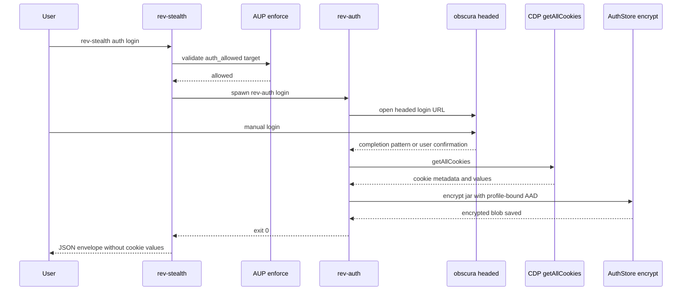
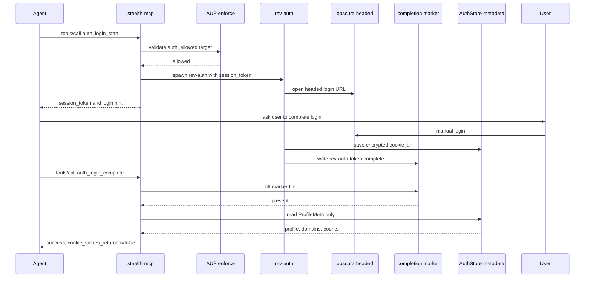
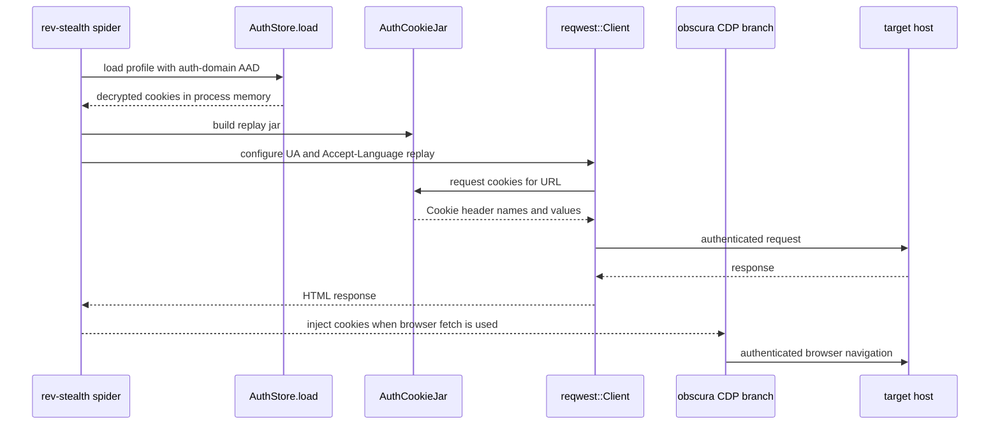

<!-- SPDX-License-Identifier: MIT -->
<!-- Source: rev_scraping Phase 9g -->

# Authenticated Scraping Flow

This document shows the Phase 9 authenticated scraping lifecycle. The flow is
human-in-the-loop by design: users authenticate manually, then the system stores
and replays encrypted cookies without exposing cookie values.

## Diagram A — CLI Capture

`rev-stealth auth login` performs AUP enforcement first, then delegates the
headed browser session to `rev-auth`. Cookie capture happens after the user has
completed login manually.

## Diagram B — MCP Two-Phase Capture

MCP login uses a start/complete split so the server never blocks an agent call
for several minutes while the human signs in. The complete call observes only
the marker and profile metadata.

## Diagram C — Spider Replay

`spider --use-auth` loads the encrypted profile, constructs an
`AuthCookieJar`, and applies the captured browser headers to HTTP fetches. When
the browser path is used, the same cookies are injected over CDP.

See also: [README §14 Authenticated Scraping](../README.md#14-authenticated-scraping-phase-9).
